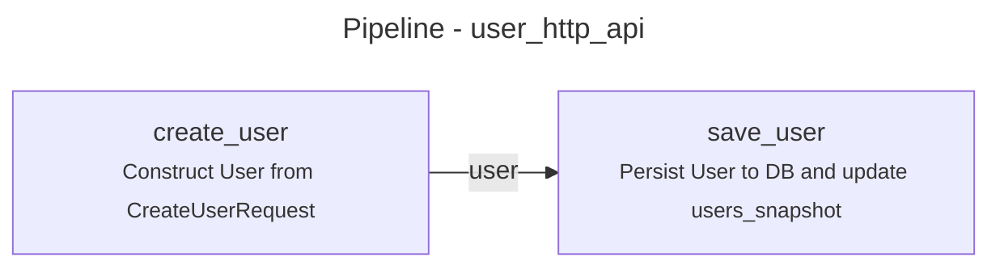
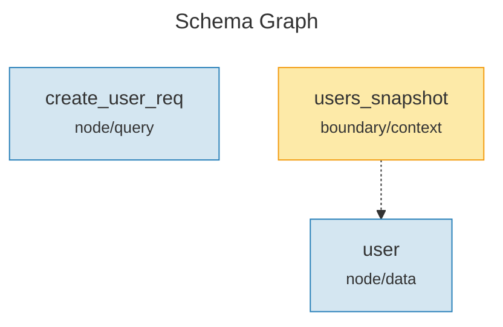
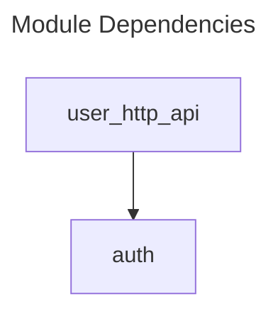
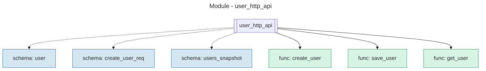
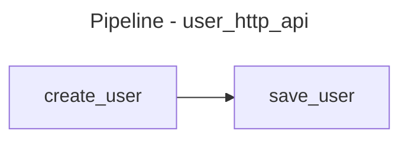

# Surv IR Export Guide

This guide demonstrates how to use the export functionality to visualize Surv IR definitions as Mermaid diagrams.

## Installation

Build the project:
```bash
cargo build --release
```

The binary will be available at `target/release/surc`.

## Export Commands

### 1. Pipeline Visualization

Export a module's pipeline to show function execution flow:

```bash
surc export pipeline <file.toml> <module-name>
```

**Example:**
```bash
surc export pipeline examples/user_api.toml user_http_api
```

**Output:**


### 2. Schema Graph

Export all schemas and their relationships:

```bash
surc export schemas <surv.toml>
```

**Example:**
```bash
surc export schemas examples/surv.toml
```

**Output:**


### 3. Module Dependencies

Export module dependency graph showing `require` relationships:

```bash
surc export modules <surv.toml>
```

**Example:**
```bash
surc export modules examples/surv.toml
```

**Output:**


### 4. Module Detail View

Export a detailed view of a single module showing all schemas and functions:

```bash
surc export module-detail <file.toml> <module-name>
```

**Example:**
```bash
surc export module-detail examples/user_api.toml user_http_api
```

**Output:**


## Viewing Diagrams

### Option 1: Mermaid Live Editor
1. Copy the output
2. Visit https://mermaid.live/
3. Paste the diagram code

### Option 2: GitHub/GitLab
Save the output in a Markdown file with triple backticks:

````markdown

````

GitHub and GitLab will render it automatically.

### Option 3: VSCode Extension
Install the "Markdown Preview Mermaid Support" extension and view `.md` files with diagrams.

## Output to File

Redirect output to a file:

```bash
surc export pipeline examples/user_api.toml user_http_api > docs/pipeline.md
```

## Error Visualization

The exporter highlights errors with red styling:
- **Undefined functions** in pipelines: marked with ⚠
- **Missing schemas**: shown in red
- **Type mismatches**: displayed as dotted lines with warnings

## Color Coding

### Schema Types
- **Node** (blue): `#d4e6f1` / `#2980b9`
- **Edge** (green): `#d5f4e6` / `#27ae60`
- **Boundary** (yellow): `#fdeaa8` / `#f39c12`
- **Space** (purple): `#e8daef` / `#8e44ad`

### Module Elements
- **Schemas**: Blue
- **Functions**: Green
- **Errors**: Red

## Tips

1. **Pipeline validation**: Pipeline exports show schema compatibility between adjacent functions
2. **Cycle detection**: Module dependency graphs highlight circular dependencies
3. **Documentation generation**: Use exports as part of CI/CD to auto-generate architecture docs
4. **Quick debugging**: Export to quickly visualize system structure during development

## Example Workflow

```bash
# 1. Check the IR file is valid
surc check examples/user_api.toml

# 2. Export pipeline for documentation
surc export pipeline examples/user_api.toml user_http_api > docs/pipelines/user_api.md

# 3. Export full project schema graph
surc export schemas examples/surv.toml > docs/schemas.md

# 4. Export module dependencies
surc export modules examples/surv.toml > docs/architecture.md
```
