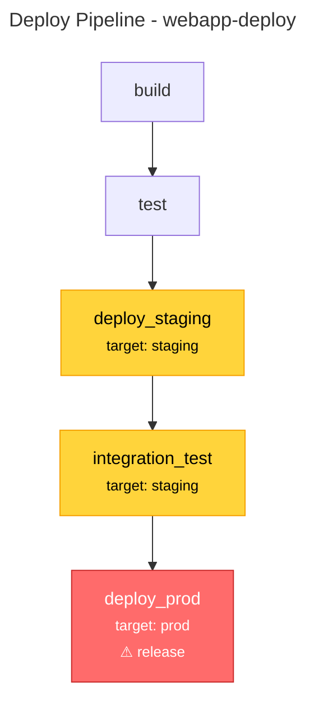

# Deploy IR Guide

This guide covers the Deploy IR features in `surc`, including validation, visualization, and code generation.

## Overview

Deploy IR is a declarative specification for deployment pipelines with security-first design. It supports:

- **DAG-based job dependencies** with cycle detection
- **Security boundaries** (targets, secrets, permissions)
- **Production safety checks** (gates, rollback, health checks)
- **Multi-platform code generation** (GitHub Actions, GitLab CI)
- **Interactive visualization** (Mermaid, HTML)

## Commands

### 1. Validation: `deploy-check`

Validate a Deploy IR file for structural and security issues.

```bash
surc deploy-check examples/deploy.toml
```

**Checks performed:**
- ✓ DAG structure (no cycles)
- ✓ Reachability (no orphaned jobs)
- ✓ Undefined references (jobs, targets, secrets, permissions, artifacts)
- ✓ Secret scope validation
- ✓ Production safety (gates, rollback, health checks)
- ✓ Side effects safety (db_migration approval)

**Example output:**
```
✓ No deploy issues found
```

### 2. Visualization: `export deploy-mermaid`

Generate a Mermaid flowchart of the deployment pipeline.

```bash
surc export deploy-mermaid examples/deploy.toml
```

**Output features:**
- Job nodes colored by target type (production: red, staging: yellow, build/test: teal)
- Dependency arrows showing job execution order
- Side effects displayed as warnings
- Target information in node labels

**Example:**


### 3. Interactive Visualization: `export deploy-html`

Generate an interactive D3.js visualization.

```bash
surc export deploy-html examples/deploy.toml > deploy_pipeline.html
```

**Features:**
- 🖱️ **Interactive graph**: Drag nodes, zoom/pan
- 🔍 **Search**: Filter jobs by name
- 📊 **Details panel**: Click nodes to see full job information
- 🎨 **Color coding**: Production (red), Staging (yellow), Build/Test (teal)
- 🔗 **Dependency highlighting**: See upstream/downstream jobs

**Details panel shows:**
- Target and environment
- Commands to execute
- Required secrets
- Produced artifacts
- Side effects
- Permissions
- Dependencies (depends on / required by)

### 4. Code Generation: `codegen`

Generate CI/CD configuration files from Deploy IR.

#### GitHub Actions

```bash
surc codegen github-actions examples/deploy.toml > .github/workflows/deploy.yml
```

**Generated features:**
- ✓ Job dependencies via `needs:`
- ✓ Environment protection for staging/production
- ✓ Secret injection via `${{ secrets.* }}`
- ✓ Manual approval comment for production (use GitHub environment protection rules)
- ✓ Smart step naming based on commands
- ✓ Checkout action for all jobs

**Example output:**
```yaml
name: Deploy Pipeline

on:
  push:
    branches: [main]
  workflow_dispatch:

jobs:
  build:
    runs-on: ubuntu-latest
    steps:
      - name: Checkout code
        uses: actions/checkout@v4
      - name: Run npm ci
        run: |
          npm ci
      # ... more steps

  deploy_prod:
    runs-on: ubuntu-latest
    environment: production
    needs: integration_test
    steps:
      - name: Checkout code
        uses: actions/checkout@v4
      - name: Run kubectl apply
        run: |
          kubectl apply -f k8s/prod/
        env:
          DB_URL: ${{ secrets.DB_URL }}
          API_KEY: ${{ secrets.API_KEY }}
      # Production deployment requires manual approval via GitHub environment protection rules
```

#### GitLab CI

```bash
surc codegen gitlab-ci examples/deploy.toml > .gitlab-ci.yml
```

**Generated features:**
- ✓ Stage-based organization (build, test, deploy)
- ✓ Job dependencies via `needs:`
- ✓ Runner tags for production/staging
- ✓ Secret injection via environment variables
- ✓ Manual approval (`when: manual`) for production
- ✓ Branch restrictions (`only: [main]`) for production
- ✓ Artifact paths for produced artifacts

**Example output:**
```yaml
stages:
  - build
  - test
  - deploy

variables:
  GIT_DEPTH: 1

build:
  stage: build
  image: ubuntu:latest
  script:
    - npm ci
    - npm run build
  artifacts:
    paths:
      - build/webapp_image

deploy_prod:
  stage: deploy
  image: ubuntu:latest
  tags:
    - production
  needs:
    - integration_test
  variables:
    DB_URL: $DB_URL
    API_KEY: $API_KEY
  script:
    - kubectl apply -f k8s/prod/
  when: manual
  only:
    - main
```

## Deploy IR Specification

See `Surv Deploy IR Specification v0.1.md` in the parent directory for the full specification.

### Key Sections

#### `[deploy.pipeline]`
Metadata about the deployment pipeline.

```toml
[deploy.pipeline]
name = "webapp-deploy"
description = "Production deployment pipeline for web application"
```

#### `[deploy.target.*]`
Deployment targets (environments).

```toml
[deploy.target.staging]
kind = "staging"
domain = "staging.example.com"

[deploy.target.prod]
kind = "production"
domain = "example.com"
```

#### `[deploy.job.*]`
Jobs in the deployment pipeline.

```toml
[deploy.job.build]
requires = []
runs = ["npm ci", "npm run build", "docker build -t webapp:latest ."]
produces = ["artifact.webapp_image"]

[deploy.job.deploy_prod]
requires = ["job.integration_test"]
runs = ["kubectl apply -f k8s/prod/"]
uses_target = "target.prod"
needs_secrets = ["secret.DB_URL", "secret.API_KEY"]
uses_perm = "perm.deployer"
side_effects = ["release"]
```

#### `[deploy.secret.*]`
Secret scoping by target.

```toml
[deploy.secret.DB_URL]
scope = ["target.prod", "target.staging"]

[deploy.secret.API_KEY]
scope = ["target.prod"]
```

#### `[deploy.perm.*]`
Permission definitions.

```toml
[deploy.perm.deployer]
role = "deploy-operator"
allows = ["deploy", "read:secrets"]
```

#### `[deploy.artifact.*]`
Build artifacts produced by jobs.

```toml
[deploy.artifact.webapp_image]
type = "docker"
repo = "ghcr.io/acme/webapp"
tag = "git_sha"
```

#### `[deploy.gate]`
Manual approval requirements.

```toml
[deploy.gate]
require_manual_approval_for = ["target.prod"]
```

#### `[deploy.rollback]`
Rollback strategy.

```toml
[deploy.rollback]
on = ["health_fail", "deploy_fail"]
strategy = "revert_traffic"
```

#### `[deploy.release]`
Release strategy and health checks.

```toml
[deploy.release]
strategy = "canary"
health_check = "https://{domain}/health"
```

## Security Features

Deploy IR enforces security best practices:

1. **Secret Scope Validation**: Jobs can only access secrets scoped to their target
2. **Production Gates**: Production deployments require manual approval gates
3. **Rollback Requirements**: Production targets must have rollback strategy defined
4. **Health Checks**: Canary/blue-green strategies require health check endpoints
5. **Side Effect Tracking**: Database migrations require explicit approval and target specification
6. **Permission Boundaries**: Jobs must declare required permissions

## Best Practices

### 1. Use Multi-Stage Pipelines

```toml
[deploy.job.build]
requires = []
# ... build steps

[deploy.job.test]
requires = ["job.build"]
# ... test steps

[deploy.job.deploy_staging]
requires = ["job.test"]
uses_target = "target.staging"
# ... deploy steps

[deploy.job.integration_test]
requires = ["job.deploy_staging"]
uses_target = "target.staging"
# ... integration test steps

[deploy.job.deploy_prod]
requires = ["job.integration_test"]
uses_target = "target.prod"
# ... production deploy
```

### 2. Scope Secrets Appropriately

```toml
# Development secrets
[deploy.secret.DEV_API_KEY]
scope = ["target.dev"]

# Staging + Production secrets
[deploy.secret.DB_URL]
scope = ["target.staging", "target.prod"]

# Production-only secrets
[deploy.secret.PROD_API_KEY]
scope = ["target.prod"]
```

### 3. Use Release Strategies

```toml
[deploy.release]
strategy = "canary"  # or "blue_green", "rolling"
health_check = "https://{domain}/healthz"

[deploy.rollback]
on = ["health_fail", "deploy_fail"]
strategy = "revert_traffic"
```

### 4. Track Side Effects

```toml
[deploy.job.migrate_db]
requires = ["job.test"]
runs = ["npm run migrate"]
uses_target = "target.prod"
side_effects = ["db_migration"]  # Requires manual approval
```

## Examples

See `examples/deploy.toml` for a complete example with:
- Build → Test → Staging → Integration Test → Production pipeline
- Secret scoping (DB_URL for both environments, API_KEY for prod only)
- Manual approval gates for production
- Rollback strategy with health checks
- Permission definitions

## Troubleshooting

### Error: Cycle detected in job dependencies

**Problem:** Jobs have circular dependencies.

**Solution:** Check the `requires` fields. Each job can only depend on jobs that don't transitively depend on it.

```toml
# ❌ Bad: A → B → A (cycle)
[deploy.job.A]
requires = ["job.B"]

[deploy.job.B]
requires = ["job.A"]

# ✓ Good: A → B (linear)
[deploy.job.A]
requires = []

[deploy.job.B]
requires = ["job.A"]
```

### Error: Job uses secret not scoped to its target

**Problem:** Job tries to access a secret that's not available in its target environment.

**Solution:** Add the target to the secret's scope.

```toml
# ❌ Bad
[deploy.job.deploy_staging]
uses_target = "target.staging"
needs_secrets = ["secret.PROD_API_KEY"]  # Only scoped to prod

[deploy.secret.PROD_API_KEY]
scope = ["target.prod"]

# ✓ Good
[deploy.secret.API_KEY]
scope = ["target.staging", "target.prod"]
```

### Error: Production job requires manual approval gate

**Problem:** Job deploys to production without a gate defined.

**Solution:** Add a `[deploy.gate]` section.

```toml
[deploy.gate]
require_manual_approval_for = ["target.prod"]
```

### Warning: Job has side_effect 'release' but no release strategy defined

**Problem:** Job triggers a release but no `[deploy.release]` section exists.

**Solution:** Define a release strategy.

```toml
[deploy.release]
strategy = "canary"
health_check = "https://{domain}/health"
```

## Integration with Surv IR

Deploy IR complements Surv IR by adding deployment orchestration:

- **Surv IR**: Describes system architecture (schemas, functions, modules)
- **Deploy IR**: Describes how to deploy that system (jobs, targets, gates)

Future phases will integrate both IRs to:
- Link modules to deployment jobs
- Validate schema migrations in deployment pipelines
- Generate infrastructure as code from both IRs

## Next Steps

- Explore the [Deploy IR Specification](../Surv%20Deploy%20IR%20Specification%20v0.1.md)
- Check out [examples/deploy.toml](examples/deploy.toml)
- View the [interactive HTML visualization](examples/deploy_pipeline.html)
- Learn about [Surv IR](Spec-Surv-IR-v1.1.md)
