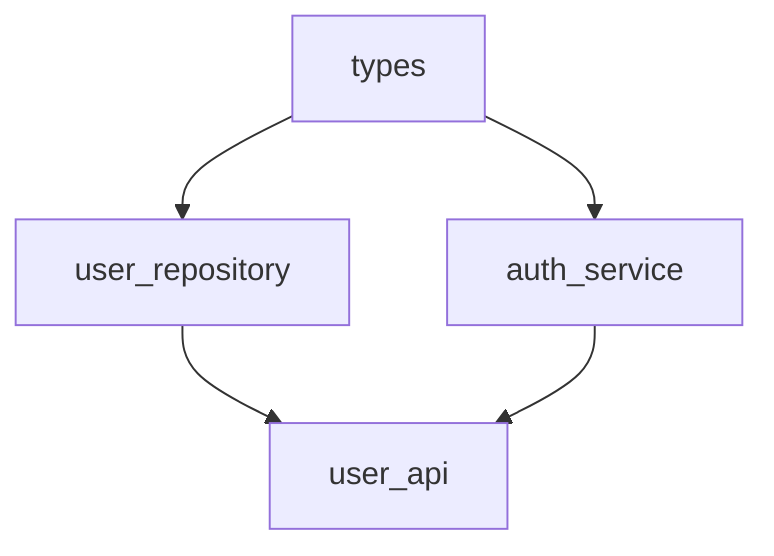
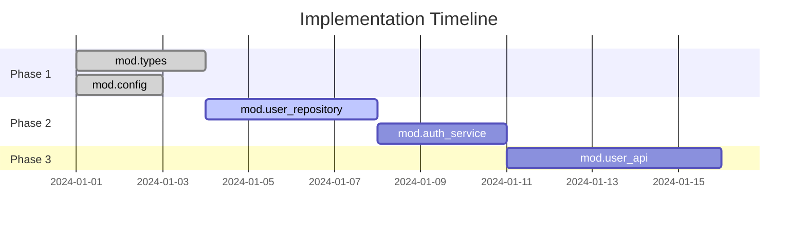

# Implementation Planning from IR

This guide shows how to use Surv IR to generate implementation plans and track progress.

## Concept

```
Surv IR (architecture)
  ↓ analyze dependencies
Implementation Plan (ordered tasks)
  ↓ execute
Progress Tracking (what's done)
  ↓ visualize
Coverage Report
```

## Manual Approach (Current)

### Step 1: Analyze Module Dependencies

```bash
surc export modules surv.toml
```

Output shows dependency order:


**Implementation order:** `types` → `user_repository` & `auth_service` → `user_api`

### Step 2: Create Implementation Checklist

From the dependency graph, create `TODO.md`:

```markdown
# Implementation Plan

## Phase 1: Foundation (no dependencies)
- [ ] mod.types
  - [ ] schema.User
  - [ ] schema.Token
  - [ ] schema.Error

## Phase 2: Data & Auth (depends on types)
- [ ] mod.user_repository (requires: types)
  - [ ] func.findUserById
  - [ ] func.createUser
  - [ ] func.updateUser
- [ ] mod.auth_service (requires: types)
  - [ ] func.login
  - [ ] func.verifyToken
  - [ ] func.refreshToken

## Phase 3: API (depends on data & auth)
- [ ] mod.user_api (requires: user_repository, auth_service)
  - [ ] func.handleGetUser
  - [ ] func.handleCreateUser
  - [ ] func.handleLogin
```

### Step 3: Track Progress

Create `progress.toml`:
```toml
[project]
name = "my-ide"
started = "2024-01-01"

[[module]]
name = "mod.types"
status = "completed"
completed_date = "2024-01-05"
functions = [
    {name = "schema.User", status = "done"},
    {name = "schema.Token", status = "done"},
]

[[module]]
name = "mod.user_repository"
status = "in_progress"
started_date = "2024-01-06"
functions = [
    {name = "func.findUserById", status = "done", tested = true},
    {name = "func.createUser", status = "in_progress", tested = false},
    {name = "func.updateUser", status = "not_started", tested = false},
]

[[module]]
name = "mod.user_api"
status = "not_started"
blocked_by = ["mod.user_repository", "mod.auth_service"]
```

### Step 4: Visualize Progress

```bash
# Future command
surc progress surv.toml progress.toml --format html > progress.html
```

Expected output:
```
Project: my-ide
Overall: 35% complete (7/20 functions)

Modules:
  ✅ mod.types          100% (3/3)   [DONE]
  🔨 mod.user_repository 33% (1/3)   [IN PROGRESS]
  ⏸️ mod.auth_service    0% (0/3)   [NOT STARTED]
  ⏸️ mod.user_api        0% (0/5)   [BLOCKED]

Next tasks:
  1. Complete func.createUser (mod.user_repository)
  2. Complete func.updateUser (mod.user_repository)
  3. Start mod.auth_service (unblocked after user_repository done)
```

## Automated Approach (Future Commands)

### `surc plan` - Generate Implementation Plan

```bash
surc plan surv.toml > plan.md
```

**Algorithm:**
1. Build module dependency graph
2. Topologically sort modules
3. For each module, list schemas → funcs → pipeline
4. Output as ordered checklist

**Example output:**
```markdown
# Implementation Plan for my-ide

Generated from: surv.toml
Total modules: 8
Total functions: 42

## Phase 1: No Dependencies (can start immediately)

### mod.types (priority: HIGH)
Required by: mod.user_repository, mod.auth_service, mod.lsp_client

**Schemas:**
- [ ] schema.User
- [ ] schema.Document
- [ ] schema.Position

**Functions:**
None (types module)

Estimated: 2-3 days

---

### mod.config (priority: MEDIUM)
Required by: mod.editor_core

**Schemas:**
- [ ] schema.Config
- [ ] schema.Theme

**Functions:**
- [ ] func.loadConfig
- [ ] func.validateConfig

Estimated: 1-2 days

---

## Phase 2: Depends on Phase 1

### mod.user_repository (priority: HIGH)
Requires: mod.types

**Functions:**
- [ ] func.findUserById
  Input: schema.UserQuery
  Output: schema.User, schema.NotFoundError
- [ ] func.createUser
  Input: schema.CreateUserData
  Output: schema.User, schema.DuplicateKeyError
- [ ] func.updateUser
  Input: schema.UpdateUserData
  Output: schema.User, schema.NotFoundError

**Pipeline:**
func.createUser → func.findUserById

Estimated: 3-4 days

---

## Phase 3: Depends on Phase 2

...
```

### `surc progress` - Track Implementation Progress

```bash
# Initialize progress tracking
surc progress init surv.toml > progress.toml

# Update progress
surc progress update progress.toml --module mod.user_repository --function func.createUser --status done

# View progress
surc progress show surv.toml progress.toml
```

**Output:**
```
Implementation Progress

Overall: ████████░░░░░░░░░░░░ 35% (7/20 functions)

By Module:
  ✅ mod.types           ████████████████████ 100% (3/3)
  🔨 mod.user_repository ██████░░░░░░░░░░░░░░  33% (1/3)
  ⏸️  mod.auth_service    ░░░░░░░░░░░░░░░░░░░░   0% (0/3)
  ⏸️  mod.user_api        ░░░░░░░░░░░░░░░░░░░░   0% (0/5)

By Phase:
  Phase 1 (Foundation):    100% ✅
  Phase 2 (Data & Auth):    14%
  Phase 3 (API):             0%

Critical Path:
  mod.user_repository → mod.user_api → mod.frontend

Next Recommended Tasks:
  1. func.createUser (blocks 3 downstream functions)
  2. func.updateUser (blocks 2 downstream functions)
  3. func.login (blocks 5 downstream functions)

Blockers:
  - mod.user_api waiting for mod.user_repository (33% done)
  - mod.frontend waiting for mod.user_api (0% done)
```

### `surc progress --gantt` - Gantt Chart

```bash
surc progress surv.toml progress.toml --format gantt > gantt.md
```

Output (Mermaid Gantt):


### `surc coverage` - Test Coverage by Module

```bash
# Assuming you have test results
surc coverage surv.toml test-results.json
```

**Output:**
```
Test Coverage by Module

mod.user_repository:
  ✅ func.findUserById     [5/5 tests passing]
  🔨 func.createUser       [2/4 tests passing]
  ❌ func.updateUser       [0/3 tests failing]

Overall: 53% functions tested (7/13)
         70% tests passing (7/10)

Untested functions:
  - mod.auth_service.func.refreshToken
  - mod.user_api.func.handleLogin
  - mod.user_api.func.handleLogout
```

## Integration with CI/CD

### GitHub Actions Example

`.github/workflows/check-ir-sync.yml`:
```yaml
name: Check IR Sync

on: [pull_request]

jobs:
  check-ir:
    runs-on: ubuntu-latest
    steps:
      - uses: actions/checkout@v4
      - name: Install surc
        run: cargo install --path .

      - name: Validate IR
        run: surc project-check surv.toml

      - name: Check for IR changes
        run: |
          if git diff --name-only origin/main | grep -q '\.toml$'; then
            echo "✅ IR files updated in this PR"
          else
            echo "⚠️ Code changed but no IR updates found"
            echo "Did you forget to update the IR?"
            exit 1
          fi

      - name: Generate progress report
        run: |
          surc progress surv.toml progress.toml --format markdown > progress-report.md
          cat progress-report.md >> $GITHUB_STEP_SUMMARY
```

## Best Practices

### 1. Update Progress Regularly

```bash
# After completing a function
surc progress update progress.toml \
  --module mod.user_repository \
  --function func.createUser \
  --status done \
  --tested true

# Commit the update
git add progress.toml
git commit -m "Complete func.createUser implementation"
```

### 2. Use IR to Plan Sprints

```bash
# Generate next sprint plan
surc plan surv.toml --unblocked --limit 5 > sprint-plan.md
```

**Output:**
```markdown
# Sprint Plan: Next 5 Unblocked Tasks

Based on current progress (35% complete)

## Recommended Tasks (sorted by impact)

1. **func.createUser** (mod.user_repository)
   - Status: In Progress
   - Blocks: 3 downstream functions
   - Impact: HIGH
   - Estimated: 1 day

2. **func.updateUser** (mod.user_repository)
   - Status: Not Started
   - Blocks: 2 downstream functions
   - Impact: MEDIUM
   - Estimated: 1 day

3. **func.login** (mod.auth_service)
   - Status: Not Started
   - Blocks: 5 downstream functions
   - Impact: HIGH
   - Estimated: 2 days

...
```

### 3. Visualize Dependency Impact

```bash
# Show what depends on a specific module
surc deps surv.toml --module mod.user_repository --downstream
```

**Output:**
```
mod.user_repository (33% complete)
  ↓ required by
  mod.user_api (0% complete)
    ↓ required by
    mod.frontend (0% complete)

If mod.user_repository is completed:
  - Unblocks mod.user_api (5 functions)
  - Transitively unblocks mod.frontend (8 functions)

Total impact: 13 functions can be started
```

## Future: AI-Assisted Planning

With IR + progress data, an AI could:

```bash
surc assist plan --ai surv.toml progress.toml
```

**AI Output:**
```
Based on your IR and current progress (35% complete),
I recommend focusing on the critical path:

Critical Path Analysis:
  mod.user_repository (33%)
    → mod.user_api (0%)
    → mod.frontend (0%)

This path blocks 60% of remaining work.

Suggested prioritization:
1. Complete mod.user_repository (1-2 days)
   - func.createUser (HIGH priority, blocks 3 functions)
   - func.updateUser (MEDIUM priority, blocks 2 functions)

2. Start mod.auth_service in parallel (2-3 days)
   - Can be done independently
   - Required by mod.user_api

3. Then implement mod.user_api (3-4 days)
   - Requires both user_repository and auth_service
   - Unblocks frontend work

Estimated timeline: 6-9 days to unblock frontend
```

## Summary

IR-driven implementation planning gives you:

✅ **Dependency-aware task ordering**
✅ **Progress tracking aligned with architecture**
✅ **Visual progress reports**
✅ **Automated sprint planning**
✅ **Impact analysis for prioritization**

The IR becomes not just architecture documentation, but an **active project management tool**.
