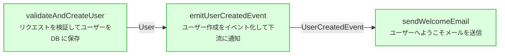

# Vibe Codingの一歩先へ、Survibe

## はじめに

本記事はSurv IRという自作の設計IRについての紹介記事です。
本記事では「Surv IRがいかに Vibe Codingの限界を補うか」を提案します。
これはVibe Codingを否定するのでは全くなく、その上(Sur)に成り立つ、より高次の設計手法です。
よろしくお願いします。

## 問題意識

提唱当初はキワモノ扱いされていたVibe Coding。
少なくないソフトウェアエンジニアがその手法に懐疑的な目を向けていました。
曰く、
  - スパゲティの量産につながる
  - 再現性が担保されていない
  - デバッグが不可能である
などなど...

しかしながら、今ではそれはContext Engineeringとして市民権を得ています。
開発業務においてCursorやClaude Code、Codexなどなどを
一切利用しないという人は珍しいのではないでしょうか。
私もCoding Agentの能力およびその向上速度には日々、驚かされるばかりです。

とはいえ、いわゆるVibe Codingには、私見では今のところ、
やはり**本質的な限界**があるように思います。
それは先にも述べた通り、**全体構成の破綻**です。
おそらくですが、設計を行う前に、個別の構成要素を、
自然言語において逐次的に指示を重ね開発するという
手法そのものに困難の原因があるのではと考えます。
それはSpec駆動開発などが主流となってきている今でも
おそらく、大きくは変わっていない。
**構造は仕様から暗黙に推定されるのみ**だからです。

ソフトウェアは、完成時点で巨大な依存関係を持っていますが、
**あくまで原理的にはその構造は事前に、決定的に確定させることができるはず**です。
またソフトウェアの複雑な構造は脳内で暗黙に推測的に保持されているのみですが、
**明示的に可視化することが必要でもあるはず**です。

また、LLMの登場以降、AIが記述するに相応しい言語についてしばしば議論になります。
未来においてAIは機械語でCodingをするようになる…という突飛な主張はしばしば目にしますし、
直近ではSuiというAI-Friendlyな言語を作る試みが日本において話題になりました。
ここで Surv IR とそれらとの違いを少しを述べると、

**Surv IRは「言語」というより「設計の中間表現」です。
これによりLLMは実装に先立って構造を確定でき、
かつ人間とマシンが同じDAGを見ながら議論できるようになります。**

私もLLMの登場に衝撃を受け、
またAI時代に相応しい言語については折に触れ考えていた者の一人です。
じっさい、2025年の夏頃に、新たな設計IRを考案・実装し、
そしてそのあとずっと放置していたのですが、
先述の流れを受け、唐突に、それを公開し世に問うてみたくなりました。
ぜひご意見賜りたく存じます。

## 改めて、Surv-IRとは

平たくいうと:
**意図ベースで書かれた設計を記述するためのtomlベースの中間言語**です。
設計レベルでの構文的な整合性の検証を可能にするパーサとツールチェーンを備えています。

固くいうと:
**Surv IR (Intermediate Representation) は、tomlをベースとした、
データスキーマ、関数、およびモジュール構成に焦点を当てた、
システムアーキテクチャを記述するための宣言型言語です。**
シンタクス(構文)とセマンティクス(意味)が厳密に定義され、そのパーサとツールチェーンはRustで記述されています。

Surv IR は、以下を記述するための標準化された手法を提供します。

- **データ構造** (schemas)
- **変換・操作** (functions)
- **構成・合成** (modules)
- **実装用メタデータ** (bindings, 言語制約)
    
**設計原則:**

- 命令的ではなく宣言的であること
- 言語に依存しないアーキテクチャ記述
- 設計と実装の分離
- ツーリングへの親和性 (パース、検証、可視化が容易であること)

要するに…
 
- 自然言語による設計段階でDAGが作れているかを検証し、
- 構成要素間の依存関係を追跡、可視化することが可能
  
ということです。
ちなみになぜtomlを選んだかですが、
jsonだと人間に見づらく、yamlだとネストがLLMにとってややこしいと思ったからです。
次のセクションでは具体的な構文を見ていきます。

## 中核構造

### schema

これはデータ構造を記述するものです。
データは関数間で受け渡しをされる境界です。
この境界の性質を宣言的に記述します。

**構文**

```toml
[schema.SchemaName]
kind = "node" | "edge" | "value"
role = "entity" | "event" | "request" | "response" | "context" | ...
type = "..."           # オプション: エイリアス/ジェネリクス用
from = "schema.X"      # オプション: edge の場合
to = "schema.Y"        # オプション: edge の場合
base = "schema.Z"      # オプション: 継承
label = "説明"          # オプション
fields = {field1 = "type1", field2 = "type2", ...}
over = ["schema.A", "schema.B"]  # オプション: 共用体型 (Union types)

# 実装用メタデータ (オプション)
impl.bind = "ActualTypeName"
impl.lang = "ts" | "rust" | "either"
impl.path = "module.path"

```

#### フィールド型

構文はシンプルです。

- プリミティブ: `string`, `int`, `float`, `bool`, `uuid`, `timestamp`
- 参照: `schema.OtherSchema`
- 配列: `string[]`, `schema.User[]`
- オプショナル: `string?`, `schema.User?`
- 共用体: スキーマの共用体には `over` フィールドを使用
    
#### Schema の種類 (Kinds)

- **node**: 独立したエンティティまたはオブジェクト
- **edge**: 2つのスキーマ間の関係 (`from` と `to` が必要)
- **value**: 値型またはプリミティブのラッパー
    
#### Schema の役割 (Roles)

役割は意味上のヒントです。

- `entity`: ドメインオブジェクト
- `event`: イベント/メッセージ
- `request`: API リクエスト
- `response`: API レスポンス
- `context`: アプリケーション状態
- `diagnostic`: エラー/警告
- `report`: 分析/レポート
- `config`: 設定

**Roles は推奨事項** であり、理解を助けるためのもので、制約を強制するものではありません。

### func (関数)

これは、まさに関数です。
関数は変換または操作を記述します。
…当たり前ですね。

**構文**

```toml
[func.FunctionName]
intent = "この関数が何をするかを人間が読める形式で記述"
input = ["schema.Input1", "schema.Input2", ...]
output = ["schema.Output1", "schema.Output2", ...]
design_notes = "オプションの実装上の注意"

# 実装用メタデータ (オプション)
impl.bind = "actual_function_name"
impl.lang = "ts" | "rust" | "either"
impl.path = "module.path"
```

#### フィールド

- **intent**: 必須。要はこれで何がしたいのかを書く欄です。
- **input**: この関数が消費するスキーマ参照の配列。
- **output**: この関数が生成するスキーマ参照の配列。

### mod (モジュール)

モジュールはスキーマと関数を、一貫性のある単位にまとめるものです。

```toml
[mod.ModuleName]
purpose = "このモジュールの責任範囲の説明"
schemas = ["schema.A", "schema.B", ...]
funcs = ["func.X", "func.Y", ...]
pipeline = ["func.X", "func.Y", ...]  # 実行フロー
boundary = {http = ["POST /users"], events = ["user.created"]}  # オプション
```

## 妥当性の検証

ここまでは、記述のための構文的規則を紹介しました。
重要なのは、構文を定義しているがゆえに、依存関係の追跡が可能であるということです。

Survの`surc check` コマンドは以下を検証します：

1. **スキーマ参照**: funcやmodから参照されているすべてのスキーマが存在すること。
2. **関数参照**: modやschemaから参照されているすべての関数が存在すること。
3. **エッジ制約**: edge に有効な `from` と `to` があること。
4. **モジュールの完全性**: パイプライン内のすべてのスキーマ/関数が宣言されていること。
5. **名前空間の衝突**: 名前空間内でシンボルが重複していないこと。

`surc check`が通るということは、論理的な破綻がないということです。
設計に関する全体的な整合性が事前に保証された状態でAIは実装作業に入ることができます。

### 参照の解決

解決の優先順位
- 完全一致: 参照に名前空間接頭辞が含まれている場合はそれを使用します。
- ローカル名前空間: 現在のファイルに名前空間がある場合、ローカル参照に接頭辞を付けます。
- クロス名前空間: 完全修飾名または import エイリアスが必要です。

## 構造の可視化

依存関係の追跡について述べました。
せっかく依存関係を定義できているのだから、それはぜひとも可視化したいところです。
Surv IRは可視化のためのコマンドをいくつか備えています。


### export,inspectコマンド

`surc export`,`surc inspect`は人間のための可視化のコマンドです。

`surc export pipeline <ファイル名.toml> <モジュール名>`

これはmodのpipelineをshellにおいて出力し、関数の実行フローをmermaidで表示するものです。

htmlに出力することも可能です。

`surc export html <ファイル名.toml> > <ファイル名.html>`


### slice,refs,traceコマンド

`slice`コマンドは特定のターゲットを実装するために必要な、最小のIR断片を抽出するものです。
— with-defsフラグにて定義内容まで出力可能です。

`refs`コマンドは指定した対象に対するすべての参照箇所を列挙するものです。
fields, input, output, pipeline, require などから対象を参照している全ての要素を返します。

`trace`
funcの場合は、モジュールのパイプライン内で前後（upstream/downstream）を辿ります。
modの場合は、共有スキーマを介して隣接するモジュールを辿ります。

上記のコマンドを理解するため、簡潔な具体例を示します。

## サンプルコードによる具体例

以下は、ユーザー作成とメール通知を含む「ユーザー管理サービス」の設計です。

```toml
# ユーザー作成 + メール通知の設計
[schema.User]
kind = "node"
role = "entity"
fields = {id = "uuid", email = "string", name = "string"}

[schema.CreateUserRequest]
kind = "node"
role = "request"
fields = {email = "string", name = "string"}

[schema.UserCreatedEvent]
kind = "node"
role = "event"
fields = {user_id = "uuid", email = "string"}

[schema.EmailNotification]
kind = "node"
role = "entity"
fields = {id = "uuid", recipient = "string", status = "string"}

# ビジネスロジック
[func.validateAndCreateUser]
intent = "リクエストを検証してユーザーをDB に保存"
input = ["schema.CreateUserRequest"]
output = ["schema.User"]

[func.emitUserCreatedEvent]
intent = "ユーザー作成をイベント化して下流に通知"
input = ["schema.User"]
output = ["schema.UserCreatedEvent"]

[func.sendWelcomeEmail]
intent = "ユーザーへようこそメールを送信"
input = ["schema.UserCreatedEvent"]
output = ["schema.EmailNotification"]

# モジュール: ドメインロジック
[mod.user_domain]
purpose = "ユーザー作成ドメインロジック"
schemas = ["schema.User", "schema.CreateUserRequest", "schema.UserCreatedEvent"]
funcs = ["func.validateAndCreateUser", "func.emitUserCreatedEvent"]
pipeline = ["func.validateAndCreateUser", "func.emitUserCreatedEvent"]

# モジュール: 通知
[mod.notification_service]
purpose = "メール通知の処理"
schemas = ["schema.EmailNotification"]
funcs = ["func.sendWelcomeEmail"]
pipeline = ["func.sendWelcomeEmail"]
boundary = {events = ["user.created"]}

# モジュール: API
[mod.user_http_api]
purpose = "ユーザー作成 REST API"
schemas = ["schema.CreateUserRequest", "schema.User", "schema.UserCreatedEvent", "schema.EmailNotification"]
funcs = ["func.validateAndCreateUser", "func.emitUserCreatedEvent", "func.sendWelcomeEmail"]
pipeline = ["func.validateAndCreateUser", "func.emitUserCreatedEvent", "func.sendWelcomeEmail"]
boundary = {http = ["POST /users"]}
```

### 検証

このファイルに対して実行：

```bash
surc check user_service.toml
✓ No issues found
```

ここで検証される内容：
- すべてのスキーマ参照が実際に存在するか
- すべての関数参照が実際に存在するか
- パイプラインのデータフロー（output → input）が一貫しているか
- 名前空間の衝突がないか

### 可視化：パイプラインの実行フロー

API の関数の実行フローを可視化：

```bash
surc export pipeline user_service.toml user_http_api
```

Mermaid 図が出力されます：




### 参照の追跡

`User` スキーマがどこで使われているか確認：

```bash
surc refs schema.User user_service.toml
```

出力：

```
schema.User is referenced by:
  - func.validateAndCreateUser (output)
  - func.emitUserCreatedEvent (input)
  - mod.user_domain (schemas)
  - mod.user_http_api (schemas)
```

**重要**: 
ここで示されるのは、**機械的に追跡可能な依存関係**です。
これにより、「Userスキーマを変更したら、どの関数・モジュールに影響があるか」が自動的に明らかになります。

### 最小片の抽出

`notification_service` モジュールを実装する際に必要な最小限の定義を抽出：

```bash
surc slice mod.notification_service user_service.toml --with-defs
```

出力：

```toml
[schema.UserCreatedEvent]
kind = "node"
role = "event"
fields = {user_id = "uuid", email = "string"}

[schema.EmailNotification]
kind = "node"
role = "entity"
fields = {id = "uuid", recipient = "string", status = "string"}

[func.sendWelcomeEmail]
intent = "ユーザーへようこそメールを送信"
input = ["schema.UserCreatedEvent"]
output = ["schema.EmailNotification"]

[mod.notification_service]
purpose = "メール通知の処理"
schemas = ["schema.EmailNotification"]
funcs = ["func.sendWelcomeEmail"]
pipeline = ["func.sendWelcomeEmail"]
```

**利点**: マニュアル検索は不要で、設計IRから必要な部分だけが抽出されます。

### 何が得られるか

このサンプルから見えること:

1. **設計は機械可読** - ツールがチェック、抽出、可視化できる
2. **依存関係は明示的** - 全体像を暗黙で持つ必要がない
3. **変更は追跡可能** - スキーマを変更したら影響を自動検出できる
4. **実装は照合可能** - 実装がIRと乖離したら検出できる

これらはすべて、**自然言語では不可能** だが **機械可読な設計ならば可能** な性質です。


## 課題と展望

最後に今後の課題と展望を述べます。

### 課題

#### コマンド体系の整理

お気づきになった方も多いと思われますが、
機能が重複しているコマンドがあるように感じています。
これらのコマンドを整理することを考えています。

#### ドキュメントの整理

多数のドキュメントがあるため、これも整理が必要です。

#### 大規模IR の分割

Surv-IRは `surc split` コマンドで、巨大な単一ファイルを複数パッケージに自動分割できます。
依存閉包を自動計算するため、人間が「どのスキーマを分割後も保持するか」を判断する必要がありません。
しかしながら、重複参照の問題をどう扱うかは現在思案中です。

#### 実装ドリフト検出

`surc diff-impl` により、IRと実装コードの乖離を検出できます。
決定的に確定している設計から、実装の遺漏を、
実際の実装から設計の不足が明らかにすることを企図しています。
LSP,tree-sitter双方での実装を行なっていますが、
LSPはやや重く、tree-sitterはやや精度に劣り、一長一短です。

#### CI/CDの統合

`surc deploy-check`コマンドを用意しています。
セキュリティ境界（ターゲット、シークレット、権限）や
本番環境の安全チェック（ゲート、ロールバック、ヘルスチェック）を記述、
DAG形成を検証し、Github Actions,Gitlabで利用できるyamlに
機械的に変換するコマンドです。
未使用なので、利用による検証と改善は今後の課題です。

#### 実装計画の記述

Deploy IRの概念はおそらく、そのまま実装計画（タスク管理）に写像することができます。

- Deploy IR の概念,実装計画への応用
- DAG (有向非巡回グラフ),モジュールや関数の依存関係
- Job (ジョブ),実装タスク (関数やモジュールの作成)
- Gate (ゲート),コードレビュー / 承認ポイント
- Side effects (副作用),破壊的変更 / リスクの高い操作
- Target (ターゲット),実装スコープ (機能 / スプリント / マイルストーン)
- Rollback (ロールバック),エラーリカバリ / 差し戻し戦略

Deploy IRを流用することにより、
設計、実装計画、CI/CDを統一的に扱うことが可能ではと考えています。

### 展望

Surv IR は以下を目指しています。

- **LLMとのシームレスな統合** 
- **リアルタイム検証** 
- **実装計画の即座の生成**
- **複数言語への自動コード生成** 
- **CI/CDの確実な実行**

つまり、LLM時代のプログラミング/エンジニアリングに相応しい、
**開発作業に必要な領域を横断的に、宣言的に記述する言語**を目指しています。

ちなみに私見ですが、ソフトウェア/アプリケーション開発の難しさはおそらく、

1. **ソフトウェアは全体として極めて膨大なグラフ的構造を持っているにもかかわらず**
2. **その全体構造は暗黙に推定され、あるいは明示的な可視化は不十分なものにとどまり**
3. **そのディレクトリ構造やコード記述、および実行順序はしばしば線型的構造を持つ**

ことにあるのではと考えます。
そして今までの世界では、この本質的な難点を解決する手段がありませんでした。
**LLMはおそらくこれを解決し得る技術*である**と私は考えていますが、
残念ながら、解決のための記述体系がありませんでした。
Vibe Codingでの困難はそれがために生まれたものであると、私は考えます。
Surv IRがこの解決に資するものであればいいなあと素朴に思います。
ご意見あればぜひとも、お待ちしております。