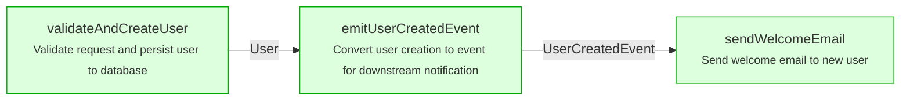

# Beyond Vibe Coding: Introducing Survibe

## Introduction

This article introduces Surv IR, a design IR I created to address fundamental challenges in LLM-assisted development.

This article proposes how Surv IR can complement Vibe Coding's limitations. This is not a rejection of Vibe Coding, but rather a higher-order design methodology that builds upon it.

LLM-assisted development has dramatically improved local productivity.
But it has also made one thing worse: our ability to reason about global structure.

Surv IR is an attempt to fix that.

## The Problem

When Vibe Coding was first proposed, it was treated as an outlier. Many software engineers were skeptical of the approach, claiming it would produce spaghetti code, lack reproducibility, and make debugging impossible.

Today, however, it has gained legitimacy as Context Engineering. It's rare to find a developer who doesn't use Cursor, Claude Code, or Codex in their work. I myself am constantly amazed by the capabilities of coding agents and their rapid improvement.

Yet I believe Vibe Coding, as it stands today, has a fundamental limitation: **the collapse of global structure**.

The difficulty stems from a simple fact: design is conducted through sequential, natural-language instructions to individual components before a global architecture is determined. Even with Spec-Driven Development becoming mainstream, this hasn't fundamentally changed. Structure is merely inferred implicitly from specifications.

Software, at completion, carries massive dependency relationships. Yet, in principle, this structure can be determined decisively beforehand. Moreover, software's complex structure is held only implicitly in our minds—it needs to be made explicitly visible.

### AI-Friendly Languages

Since the emergence of LLMs, there's been recurring discussion about languages suited to AI. I've seen claims that future AI will code in machine language, and recently, projects like Sui attempt to create AI-friendly programming languages in Japan.

Here's the distinction with Surv IR:

- **Sui** is "AI-friendly" as an **implementation language**
- **Surv IR** is "AI-friendly" as a **design language**

Surv IR is not so much a "language" as a **machine-readable intermediate representation of design**. This allows LLMs to determine structure before implementation and enables humans and machines to discuss the same DAG together.

### Why Now?

I was deeply impressed by LLM technology and, like many, have periodically thought about languages suited to the AI age. In fact, around 2025, I designed and implemented a new design IR but subsequently abandoned it. However, in light of recent developments—particularly the maturation of LLM-powered Context Engineering—I felt compelled to release it and put it before the community.

I would greatly appreciate your feedback.

## What is Surv IR?

**Simply put:**
A middle-ground language for describing intent-based design, equipped with a toolchain for verifying syntactic consistency at the design level.

**Formally:**
**Surv IR** (Intermediate Representation) is a declarative language, based on TOML, for describing system architecture with focus on data schemas, functions, and module composition.

Surv IR provides a standardized way to describe:

- **Data structures** (schemas)
- **Transformations and operations** (functions)
- **Composition and assembly** (modules)
- **Implementation metadata** (bindings, language constraints)

### Design Principles

- **Declarative, not imperative**
- **Language-independent architecture description**
- **Separation of design and implementation**
- **Affinity with tooling** (easy to parse, validate, visualize)

### Core Value

- Verify whether a DAG can be constructed during the natural-language design phase
- Track and visualize dependency relationships between components

The following section explores the concrete syntax.

## Core Structures

### Schema

Schemas describe data structures—the boundaries across which functions exchange data. We declare the nature of these boundaries explicitly.

**Syntax**
```toml
[schema.SchemaName]
kind = "node" | "edge" | "value"
role = "entity" | "event" | "request" | "response" | "context" | ...
type = "..."           # Optional: for aliases/generics
from = "schema.X"      # Optional: for edge
to = "schema.Y"        # Optional: for edge
base = "schema.Z"      # Optional: inheritance
label = "description"
fields = {field1 = "type1", field2 = "type2", ...}
over = ["schema.A", "schema.B"]  # Optional: Union types

# Implementation metadata (optional)
impl.bind = "ActualTypeName"
impl.lang = "ts" | "rust" | "either"
impl.path = "module.path"
```

#### Field Types

Syntax is simple:

- **Primitives**: `string`, `int`, `float`, `bool`, `uuid`, `timestamp`
- **References**: `schema.OtherSchema`
- **Arrays**: `string[]`, `schema.User[]`
- **Optional**: `string?`, `schema.User?`
- **Unions**: Use `over` field for schema unions

#### Schema Kinds

- **node**: Independent entity or object
- **edge**: Relationship between two schemas (requires `from` and `to`)
- **value**: Value type or primitive wrapper

#### Schema Roles

Roles are semantic hints:

- `entity`: Domain object
- `event`: Event/message
- `request`: API request
- `response`: API response
- `context`: Application state
- `diagnostic`: Error/warning
- `report`: Analysis/report
- `config`: Configuration

**Roles are recommendations**, aiding understanding, not enforcing constraints.

### Func (Function)

Functions are, well, functions. They describe transformations or operations.

**Syntax**

```toml
[func.FunctionName]
intent = "Human-readable description of what this function does"
input = ["schema.Input1", "schema.Input2", ...]
output = ["schema.Output1", "schema.Output2", ...]
design_notes = "Optional implementation notes"

# Implementation metadata (optional)
impl.bind = "actual_function_name"
impl.lang = "ts" | "rust" | "either"
impl.path = "module.path"
```

#### Fields

- **intent**: Required. The core purpose of the function.
- **input**: Array of schema references consumed by this function.
- **output**: Array of schema references produced by this function.

### Mod (Module)

Modules compose schemas and functions into cohesive units.

```toml
[mod.ModuleName]
purpose = "Description of this module's responsibility"
schemas = ["schema.A", "schema.B", ...]
funcs = ["func.X", "func.Y", ...]
pipeline = ["func.X", "func.Y", ...]  # execution flow
boundary = {http = ["POST /users"], events = ["user.created"]}  # optional
```

## Validation

The syntax rules above enable dependency tracking—the critical benefit.

The `surc check` command validates:

1. **Schema references**: All referenced schemas exist
2. **Function references**: All referenced functions exist
3. **Edge constraints**: Edge definitions have valid `from` and `to`
4. **Module completeness**: All schemas/functions in the pipeline are declared
5. **Namespace collisions**: No duplicate symbols in namespace

When `surc check` passes, logical consistency is guaranteed. **AI can enter the implementation phase with globally coherent design.**

## Visualizing Structure

Since we can define dependencies, we want to visualize them. Surv IR provides several visualization commands.

### export and inspect Commands

`surc export` and `surc inspect` are human-focused visualization tools.

```bash
surc export pipeline <file.toml> <module_name>
```

This outputs the module's pipeline as a Mermaid flowchart showing function execution flow.

```bash
surc export html <file.toml> > <file.html>
```

HTML export is also available.

### slice, refs, trace Commands

`slice` extracts the minimal IR fragment needed to implement a specific target, with full definitions via `--with-defs`.

`refs` lists all reference locations for a given target, returning all elements that reference it through fields, input, output, pipeline, require, etc.

`trace` traces pipeline flow (upstream/downstream) for functions, and for modules traces adjacent modules via shared schemas.

## Concrete Example

To understand these commands, here's a simple example: a "User Management Service" with user creation and email notifications.

```toml
# User creation + email notification design
[schema.User]
kind = "node"
role = "entity"
fields = {id = "uuid", email = "string", name = "string"}

[schema.CreateUserRequest]
kind = "node"
role = "request"
fields = {email = "string", name = "string"}

[schema.UserCreatedEvent]
kind = "node"
role = "event"
fields = {user_id = "uuid", email = "string"}

[schema.EmailNotification]
kind = "node"
role = "entity"
fields = {id = "uuid", recipient = "string", status = "string"}

# Business logic
[func.validateAndCreateUser]
intent = "Validate request and persist user to database"
input = ["schema.CreateUserRequest"]
output = ["schema.User"]

[func.emitUserCreatedEvent]
intent = "Convert user creation to event for downstream notification"
input = ["schema.User"]
output = ["schema.UserCreatedEvent"]

[func.sendWelcomeEmail]
intent = "Send welcome email to new user"
input = ["schema.UserCreatedEvent"]
output = ["schema.EmailNotification"]

# Module: Domain logic
[mod.user_domain]
purpose = "User creation domain logic"
schemas = ["schema.User", "schema.CreateUserRequest", "schema.UserCreatedEvent"]
funcs = ["func.validateAndCreateUser", "func.emitUserCreatedEvent"]
pipeline = ["func.validateAndCreateUser", "func.emitUserCreatedEvent"]

# Module: Notification
[mod.notification_service]
purpose = "Email notification handling"
schemas = ["schema.EmailNotification"]
funcs = ["func.sendWelcomeEmail"]
pipeline = ["func.sendWelcomeEmail"]
boundary = {events = ["user.created"]}

# Module: API
[mod.user_http_api]
purpose = "REST API for user creation"
schemas = ["schema.CreateUserRequest", "schema.User", "schema.UserCreatedEvent", "schema.EmailNotification"]
funcs = ["func.validateAndCreateUser", "func.emitUserCreatedEvent", "func.sendWelcomeEmail"]
pipeline = ["func.validateAndCreateUser", "func.emitUserCreatedEvent", "func.sendWelcomeEmail"]
boundary = {http = ["POST /users"]}
```

### Validation

Running on this file:

```bash
surc check user_service.toml
✓ No issues found
```

This verifies:
- All schema references actually exist
- All function references actually exist
- Pipeline data flow (output → input) is consistent
- No namespace collisions

### Visualization: Pipeline Execution Flow

Visualize the API's function execution flow:

```bash
surc export pipeline user_service.toml user_http_api
```

This generates a Mermaid diagram:



### Reference Tracking

Check where the `User` schema is used:

```bash
surc refs schema.User user_service.toml
```

Output:

```
schema.User is referenced by:
  - func.validateAndCreateUser (output)
  - func.emitUserCreatedEvent (input)
  - mod.user_domain (schemas)
  - mod.user_http_api (schemas)
```

**Importantly:** This represents **mechanically-traceable dependencies**. When you modify the User schema, the tool automatically reveals which functions and modules are affected.

### Minimal Fragment Extraction

To implement the `notification_service` module, extract the minimal required definitions:

```bash
surc slice mod.notification_service user_service.toml --with-defs
```

Output:

```toml
[schema.UserCreatedEvent]
kind = "node"
role = "event"
fields = {user_id = "uuid", email = "string"}

[schema.EmailNotification]
kind = "node"
role = "entity"
fields = {id = "uuid", recipient = "string", status = "string"}

[func.sendWelcomeEmail]
intent = "Send welcome email to new user"
input = ["schema.UserCreatedEvent"]
output = ["schema.EmailNotification"]

[mod.notification_service]
purpose = "Email notification handling"
schemas = ["schema.EmailNotification"]
funcs = ["func.sendWelcomeEmail"]
pipeline = ["func.sendWelcomeEmail"]
```

**Advantage:** No manual searching needed—the tool extracts exactly what you need from the design IR.

### What This Reveals

From this sample, we see:

1. **Design is machine-readable** - Tools can check, extract, visualize
2. **Dependencies are explicit** - No need to implicitly hold the global picture
3. **Changes are traceable** - Modifying a schema automatically reveals impact
4. **Implementation is verifiable** - Detect when implementation drifts from IR

All of these are **impossible in natural language** but **possible with machine-readable design**.

## Challenges and Future Directions

### Current Challenges

#### Command System Organization

Some commands have overlapping functionality. We're considering reorganization.

#### Documentation

With many documents, organization is needed.

#### Large IR Splitting

Surv IR's `surc split` command automatically partitions massive single files into multiple packages. Since dependency closure is auto-computed, you don't manually decide "which schemas to keep post-split?" But handling duplicate references is currently under consideration.

#### Implementation Drift Detection

`surc diff-impl` detects IR-code divergence. With deterministic design, implementation omissions become visible. We've implemented both LSP and tree-sitter approaches—LSP is somewhat heavy, tree-sitter somewhat lacks precision. Tradeoffs both ways.

#### CI/CD Integration

`surc deploy-check` codifies security boundaries (targets, secrets, permissions) and production safeguards (gates, rollback, health checks). It detects DAG formation and converts to GitHub Actions/GitLab YAML. Validation and improvement remain future work.

#### Implementation Planning

Deploy IR concepts map naturally to implementation planning (task management):

- Deploy IR concepts → implementation planning
- DAG (directed acyclic graph) → module/function dependencies
- Job → implementation task (creating functions/modules)
- Gate → code review / approval point
- Side effects → breaking changes / risky operations
- Target → implementation scope (feature / sprint / milestone)
- Rollback → error recovery / revert strategy

By reusing Deploy IR, we can address design, implementation planning, and CI/CD uniformly.

### Vision

Surv IR aims toward:

- **Seamless LLM integration**
- **Real-time validation**
- **Immediate implementation plan generation**
- **Multi-language automatic code generation**
- **Reliable CI/CD execution**

In other words, a declarative language spanning development domains, suited to LLM-era programming and engineering.

### The Core Insight

I believe software/application development's difficulty stems from:

1. **Software carries enormous graph-like structure globally**
2. **Yet this structure is inferred implicitly, with visualization falling short**
3. **Directory structure and execution order are often linear**

Until now, there was no means to solve this fundamental problem. LLMs are likely the technology to solve it, yet a descriptive framework was missing.

I hope Surv IR contributes to this solution. 
I welcome your thoughts.
Does this resonate with your experience?
How do you currently keep global structure in LLM-heavy projects?
What would you want from a design-level IR?