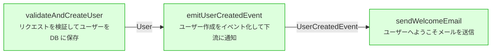

# (article supplement) 具体例：User Service の設計

上記のコマンドを理解するため、簡潔な具体例を示します。

## サンプルコード

以下は、ユーザー作成とメール通知を含む「ユーザー管理サービス」の設計です。

```toml
# ユーザー作成 + メール通知の設計
[schema.User]
kind = "node"
role = "entity"
fields = {id = "uuid", email = "string", name = "string"}

[schema.CreateUserRequest]
kind = "node"
role = "request"
fields = {email = "string", name = "string"}

[schema.UserCreatedEvent]
kind = "node"
role = "event"
fields = {user_id = "uuid", email = "string"}

[schema.EmailNotification]
kind = "node"
role = "entity"
fields = {id = "uuid", recipient = "string", status = "string"}

# ビジネスロジック
[func.validateAndCreateUser]
intent = "リクエストを検証してユーザーをDB に保存"
input = ["schema.CreateUserRequest"]
output = ["schema.User"]

[func.emitUserCreatedEvent]
intent = "ユーザー作成をイベント化して下流に通知"
input = ["schema.User"]
output = ["schema.UserCreatedEvent"]

[func.sendWelcomeEmail]
intent = "ユーザーへようこそメールを送信"
input = ["schema.UserCreatedEvent"]
output = ["schema.EmailNotification"]

# モジュール: ドメインロジック
[mod.user_domain]
purpose = "ユーザー作成ドメインロジック"
schemas = ["schema.User", "schema.CreateUserRequest", "schema.UserCreatedEvent"]
funcs = ["func.validateAndCreateUser", "func.emitUserCreatedEvent"]
pipeline = ["func.validateAndCreateUser", "func.emitUserCreatedEvent"]

# モジュール: 通知
[mod.notification_service]
purpose = "メール通知の処理"
schemas = ["schema.EmailNotification"]
funcs = ["func.sendWelcomeEmail"]
pipeline = ["func.sendWelcomeEmail"]
boundary = {events = ["user.created"]}

# モジュール: API
[mod.user_http_api]
purpose = "ユーザー作成 REST API"
schemas = ["schema.CreateUserRequest", "schema.User", "schema.UserCreatedEvent", "schema.EmailNotification"]
funcs = ["func.validateAndCreateUser", "func.emitUserCreatedEvent", "func.sendWelcomeEmail"]
pipeline = ["func.validateAndCreateUser", "func.emitUserCreatedEvent", "func.sendWelcomeEmail"]
boundary = {http = ["POST /users"]}
```

## 検証

このファイルに対して実行：

```bash
surc check user_service.toml
✓ No issues found
```

ここで検証される内容：
- すべてのスキーマ参照が実際に存在するか
- すべての関数参照が実際に存在するか
- パイプラインのデータフロー（output → input）が一貫しているか
- 名前空間の衝突がないか

## 可視化：パイプラインの実行フロー

API の関数の実行フローを可視化：

```bash
surc export pipeline user_service.toml user_http_api
```

Mermaid 図が出力されます：



## 参照の追跡

`User` スキーマがどこで使われているか確認：

```bash
surc refs schema.User user_service.toml
```

出力：

```
schema.User is referenced by:
  - func.validateAndCreateUser (output)
  - func.emitUserCreatedEvent (input)
  - mod.user_domain (schemas)
  - mod.user_http_api (schemas)
```

**重要**: ここで示されるのは、**機械的に追跡可能な依存関係**です。
これにより、「User スキーマを変更したら、どの関数・モジュールに影響があるか」が自動的に明らかになります。

## 最小片の抽出

`notification_service` モジュールを実装する際に必要な最小限の定義を抽出：

```bash
surc slice mod.notification_service user_service.toml --with-defs
```

出力：

```toml
[schema.UserCreatedEvent]
kind = "node"
role = "event"
fields = {user_id = "uuid", email = "string"}

[schema.EmailNotification]
kind = "node"
role = "entity"
fields = {id = "uuid", recipient = "string", status = "string"}

[func.sendWelcomeEmail]
intent = "ユーザーへようこそメールを送信"
input = ["schema.UserCreatedEvent"]
output = ["schema.EmailNotification"]

[mod.notification_service]
purpose = "メール通知の処理"
schemas = ["schema.EmailNotification"]
funcs = ["func.sendWelcomeEmail"]
pipeline = ["func.sendWelcomeEmail"]
```

**利点**: マニュアル検索は不要。設計IRから必要な部分だけが抽出されます。

## 何が得られるか

このサンプルから見えることは：

1. **設計は機械可読** - ツールがチェック、抽出、可視化できる
2. **依存関係は明示的** - 全体像を暗黙で持つ必要がない
3. **変更は追跡可能** - スキーマを変更したら影響を自動検出できる
4. **実装は照合可能** - 実装がIRと乖離したら検出できる

これらはすべて、「自然言語では不可能」だが「機械可読な設計ならば可能」な性質です。

---

注：完全な例は `examples/blog_sample_user_service.toml` と `examples/blog_sample_explanation.md` を参照してください。
